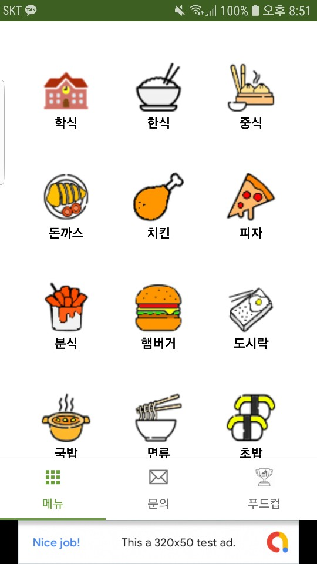
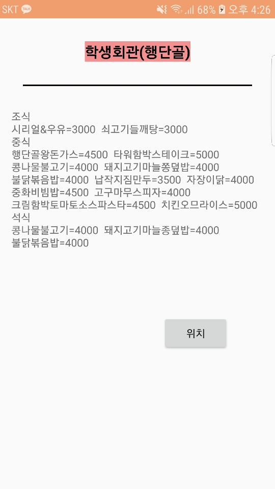

# SKKU_FOOD
Practice for Android Application
 
 

## Environments
- Kotlin (Language)
- Android Studio 3.0 (IDE)
- API 28
- SQLite (Local Database)
- Only Portrait Screen

## Libraries
- Room 2.1.0
- jsoup 1.11.3
- Admob (Google 광고)
- Picasso 2.7
- KakaoMap
- Androidx (Jetpack)

## Description
Android Application that can find restaurants nearby SKKU (In Suwon)
 

## Functions
### Foods
- You can choose category of foods (Total 15)
- You can also check menu of school cafeteria (By Crawling)
 

### Restaurants
- You can see just list of restaurants nearby SKKU
 

### Tournament (FoodCup)
- You can choose food and restaurant by tournament method
 

## App Examples

## ISSUE

